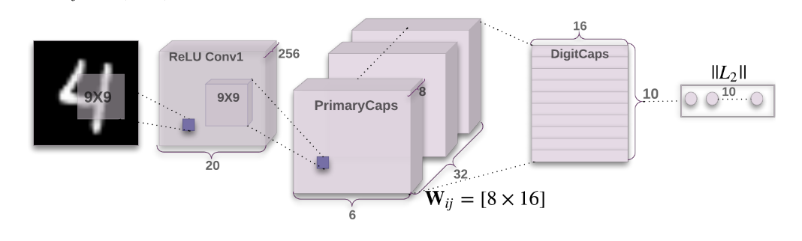

# CapsNet-Pytorch (single base capsNet)

A Pytorch implementation of CapsNet based on Geoffrey Hinton's paper [Dynamic Routing Between Capsules](https://arxiv.org/abs/1710.09829)

## Requirements

torch==1.8.1

torchvision==0.9.1

numpy==1.19.2

## run
`python main.py`

